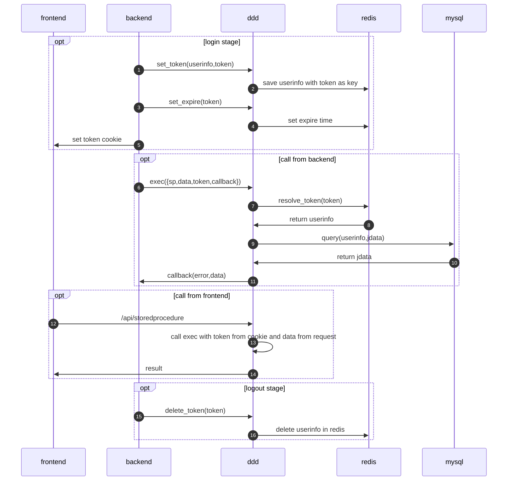
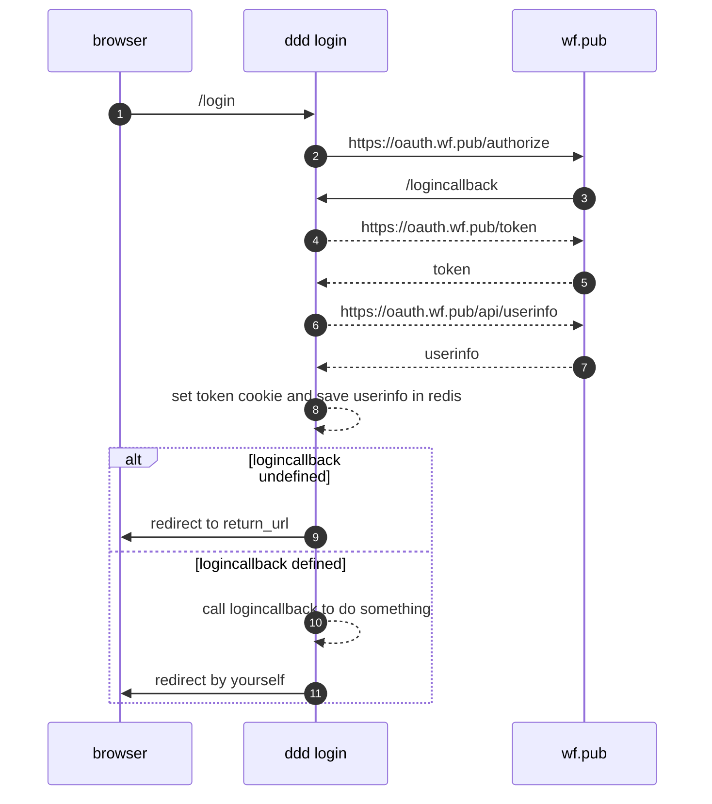
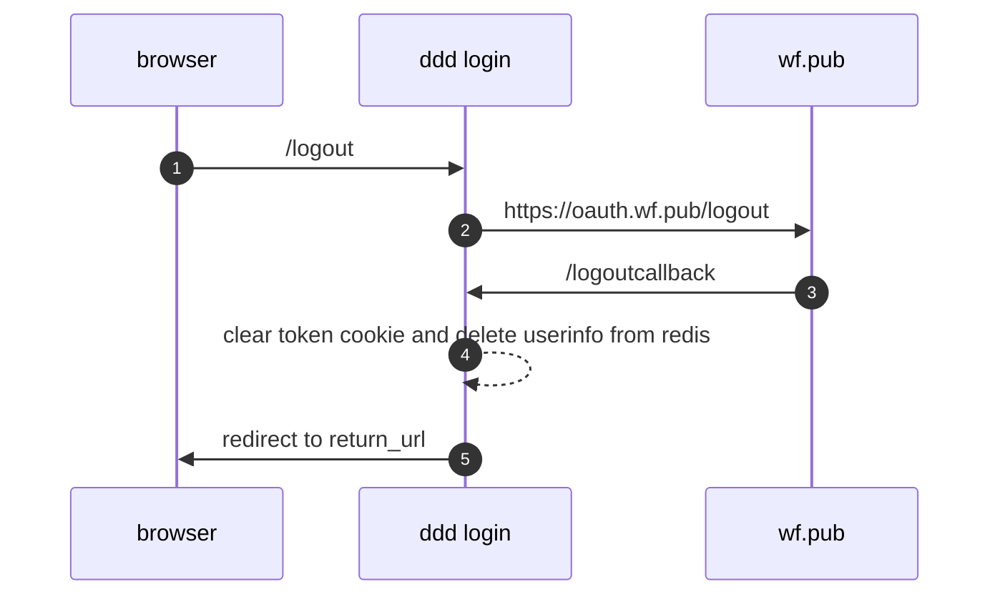

# wf-mysql-ddd
<script src='http://com.wf.pub/jsbuilder/thin.js'></script>


## 工作原理


## 安装wf-mysql-ddd 模块

### 从gitlab.wf.pub安装最新版本
```shell
npm install git+http://gitlab.wf.pub/liwei/wf-mysql-ddd
```

## 配置文件config.js
``` javascript

module.exports={
    mysql: {
        host: "xxx.xxx.xxx.xxx",
        database: "xxx",
        user: "root",
        password: "xxxx",
        port: '3306'
    },
    redis: {
        host: "xxx.xxx.xxx.xxx",
        port: "6379",
        password: "xxx"
    },
}

```


## 在app.js添加wf-mysql-ddd的引用配置和路由

``` javascript

let ddd = require('./wf-mysql-ddd');
let config = require('./config.js');
ddd.conn = config.conn;
ddd.redis = config.redis;
app.use(ddd.login(config.wfpub, require('./lib/logincallback'))); //wfpub登录集成,必须放在index路由前面；
app.use('/api', ddd.api);

```

## 测试api访问

http://xxx/api


## 登录cookie

wf-mysql-ddd使用名为token的cookie标识用户身份，你的登录系统在登录后应设置此cookie并将用户身份信息以token:{token_value}为key写入redis，www_mysql_ddd会使用此键解析用户身份信息。

## 使用wf_mysql_ddd发布服务

在mysql数据库中建立名为ddd_{service_name}的存储过程，此存储过程接受两个参数：

1. token json
2. inout jdata json


## 从前端调用mysql服务

* get http://{userhost}/api/{service_name}
* post http://{userhost}/api/{service_name}

## 从后端调用mysql服务

### exec
```javascript
ddd.exec({
    sp:ddd_{service_name},
    token: req.cookies["token"],
    data: req.query,
    callback: function(err, r) {
        //sample callback begin
        if (err) {
            res.status(err);
            res.send(r);
        } else {
            res.set('content-type', 'application/json');
            res.send(r);
        }
        //sample callback end
    },
});
```
### execPromise
```javascript
ddd.execPromise({
    sp:'ddd_stored_procedure_name',
    data:{yourdata:''}
    }).then(data => {
        console.log(data)
    }).catch(error => {
        console.log(error)
    });
```

### set_token
```javascript
ddd.set_token(userdata,token);

```
### set_expire
```javascript
ddd.set_expire(token,timeoutseconds);

```

### delete_token
```javascript
ddd.delete_token(token);
```
### whois

###


### 注意事项：

前缀带ddd_的存储过程可以从前端调用，不允许外部调用不应该有ddd前缀，从服务器端可以直接用存储过程名调用不对外开放的的ddd存储过程。

## wfpub登录集成


```javascript
app.use(ddd.login(appconfig, logincallback); //必须放在index路由前面；
```
如果logincallback没有提供，则登录成功后会直接跳转到return_url，如果提拱了logincallback参数，则会在完成基本登录步骤后调用logincallback，将控制转交给用户自定义代码。

### appconfig

```javascript
    {
        client_id: 42,                  //应用id，请到wf.pub/open注册
        app_url: 'https://l.wf.pub',    //网站的url，与开放平台填写的一致。
        cookieprefix: 'l.wf.pub.'       //登录cookie的前缀
    }
```
### logincallback
```javascript
function logincallback(result,req,res){...}
```

### login

浏览器导航到
```
/login?return_url=/xxx
```
return_url未填写时会自动使用req.headers.referer 



### logout

浏览器导航到
```
/logout?return_url=/xxx
```
return_url未填写时会自动使用req.headers.referer 



## 开发自定义登录

如果需要使用wf.pub集成登录，可以自行开发登录模块。


